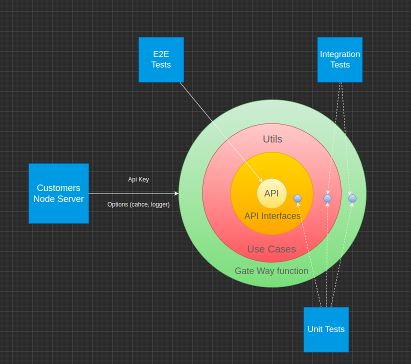
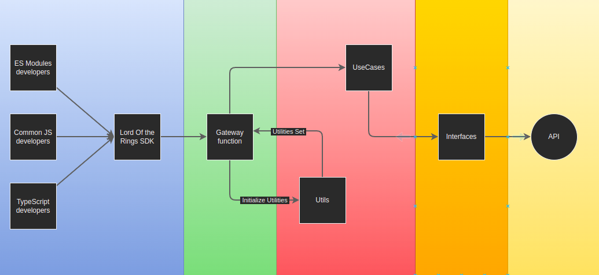

# SDK Design

This SDK is built up by following Clean Architecture principles. The main idea is to provide hybrid package without dependencies to fit different development strategies.
Clean Architecture splits the layers between developers and API. It manages reducing of dependencies by giving a single vector of layers interaction. It makes code more flexible and scalable. So new changes will not effect any existing code.

---

## Elements

### API

As API is a source, that we can not change it stands as a core inside of the system. We may run acceptance tests time to time, to understand if changes has appeared at the API side.

### Interfaces

This layer is simply reflecting all possible queries to API. It's gonna be changed just in case the API will be extend or critically changed.

### Use Cases and Utils

Use cases is completely dynamic part of intermediate level. All the changes and extensions must happen at this level. Features will appear here, so we can completely satisfy developers needs, just by extending useCases methods

At the same time utils has to reflect the picture in useCases, and help to serve them properly.
It's a right place for initializers and utility functions that can be reused in future.

### Gateway function

In the head of all is a gateway function. Simple closure, that returns a banch of methods, providing access to different useCases methods. It's responsible for inititalizing function of context, that are used under different architecture levels.

---

## Features

### Cache

It's a RAM cache with self-cleaning mechanique. You can set a `cacheTime` property to make it enabled. It will store API responses in RAM so you will be interacting with SDK in case of recurring queries. Placing initialization of SDK at a top level of an application will help to fix an issue with a API requests limitation.

### Logger

Everything important that can be logged has to be logged. In further versions we have to provide a technique of retreiving logs from SDK. It can be developed by writting a log to dirrectory provided by user(recomended), or by integration with Redis (less preferable as it will bring external dependency);

---

## SDK Flow

Here is a visual reproduction of SDK flow with main elements on it:

